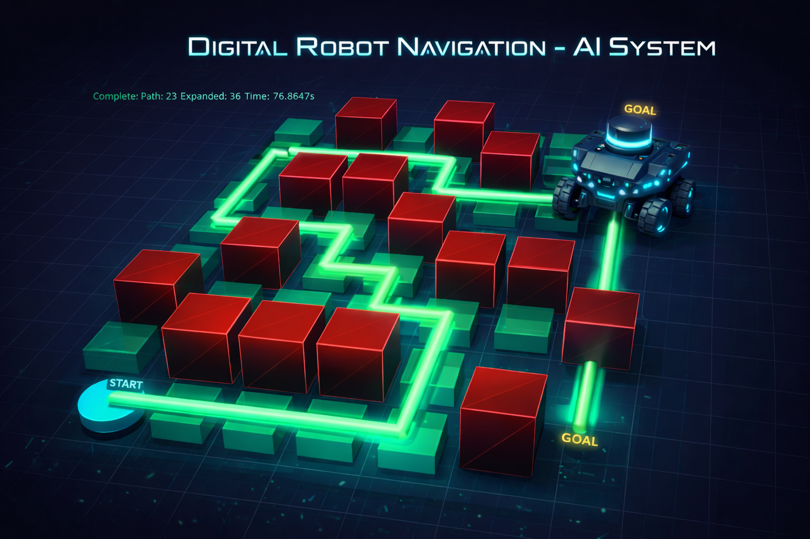
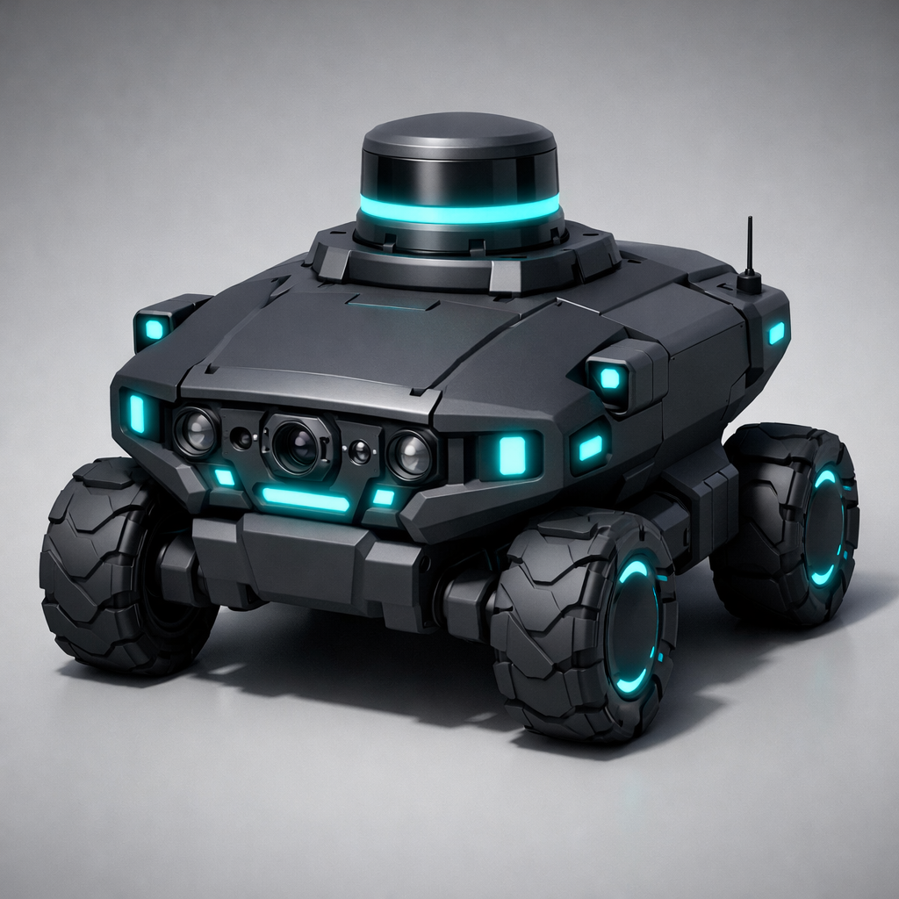
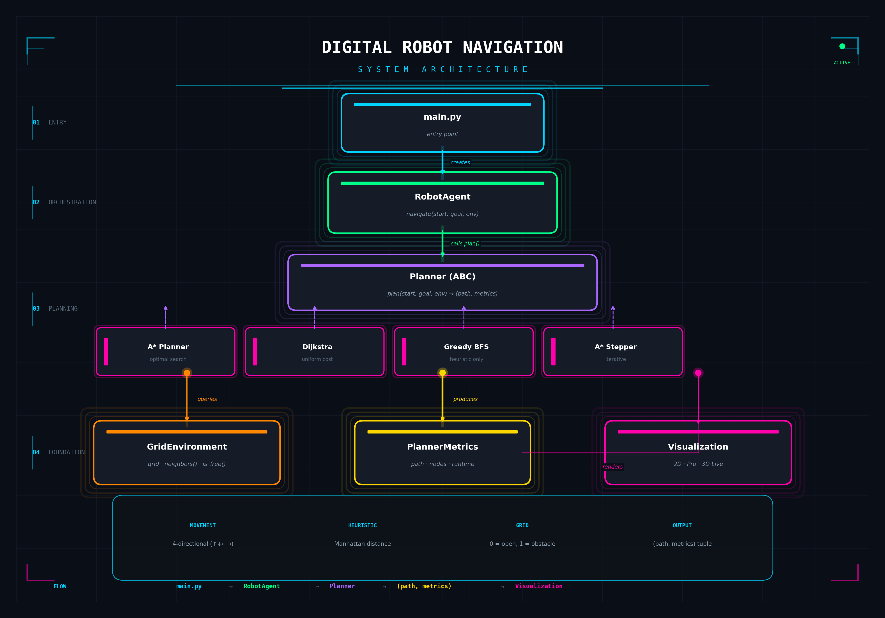

<div align="center">



# 🤖 Digital Robot Navigation

### Intelligent Pathfinding System with Real-Time 3D Visualization

[](https://python.org)
[](#ai-algorithms)
[](https://pyvista.org)
[](LICENSE)

**A production-grade autonomous navigation system implementing classical AI search algorithms with real-time 3D visualization, modular architecture, and extensible planner framework.**

[Getting Started](#-quick-start) · [Architecture](#-system-architecture) · [Algorithms](#-ai-algorithms) · [Visualization](#-visualization-modes) · [Documentation](#-api-reference)

---

</div>

## 📋 Table of Contents

- [Overview](#-overview)
- [Key Features](#-key-features)
- [AI Algorithms](#-ai-algorithms)
- [System Architecture](#-system-architecture)
- [Installation](#-installation)
- [Quick Start](#-quick-start)
- [Visualization Modes](#-visualization-modes)
- [Configuration](#-configuration)
- [API Reference](#-api-reference)
- [Performance Metrics](#-performance-metrics)
- [Project Structure](#-project-structure)
- [Technology Stack](#-technology-stack)
- [Future Roadmap](#-future-roadmap)
- [Contributing](#-contributing)
- [License](#-license)

---

## 🎯 Overview

**Digital Robot Navigation** is an advanced pathfinding simulation that demonstrates the application of classical artificial intelligence search algorithms to autonomous robot navigation. The system models a robot operating in a discrete grid-based environment with obstacles, computing optimal or near-optimal paths from start to goal positions.

This project bridges theoretical AI concepts with practical implementation, featuring:

- **Multiple Search Algorithms** — A*, Dijkstra, Greedy Best-First Search with unified interface
- **Real-Time 3D Visualization** — Interactive PyVista-powered environment with live search progression
- **Modular Architecture** — Clean separation of concerns enabling easy algorithm extension
- **Performance Analytics** — Comprehensive metrics tracking (nodes expanded, runtime, path optimality)

<div align="center">

### The Autonomous Agent



*AI-powered navigation agent rendered from a procedurally generated GLB model with PBR materials*

</div>

---

## ✨ Key Features

| Feature | Description |
|---------|-------------|
| 🧠 **Intelligent Search** | Four pathfinding algorithms with configurable heuristics |
| 🎮 **3D Live Visualization** | Real-time search progression with interactive camera controls |
| 📊 **Performance Metrics** | Track nodes expanded, path length, and execution time |
| 🔌 **Extensible Design** | Abstract Planner base class for custom algorithm implementation |
| 🎨 **Multiple Viz Modes** | Basic 2D, Professional 2D, and 3D Live rendering options |
| ⚡ **Optimized Runtime** | Efficient priority queue-based implementations |
| 🤖 **3D Robot Model** | GLB format support with automatic scaling and orientation |

---

## 🧠 AI Algorithms

This system implements foundational search algorithms from artificial intelligence, each with distinct characteristics:

### A* Search (Optimal)

The gold standard for informed search, A* combines actual path cost `g(n)` with heuristic estimate `h(n)`:

```
f(n) = g(n) + h(n)
```

- **Completeness**: ✅ Guaranteed to find a solution if one exists
- **Optimality**: ✅ Always finds the shortest path (with admissible heuristic)
- **Time Complexity**: O(b^d) where b = branching factor, d = depth
- **Space Complexity**: O(b^d) — stores all generated nodes

### Dijkstra's Algorithm (Uniform Cost)

The uninformed variant that considers only actual path cost:

```
f(n) = g(n)
```

- **Completeness**: ✅ Guaranteed
- **Optimality**: ✅ Always optimal
- **Trade-off**: Explores more nodes than A* (no heuristic guidance)

### Greedy Best-First Search (Fast)

Prioritizes nodes closest to the goal (heuristic only):

```
f(n) = h(n)
```

- **Completeness**: ❌ May fail in infinite spaces
- **Optimality**: ❌ Not guaranteed
- **Trade-off**: Very fast but may find suboptimal paths

### A* Stepper (Iterative)

Custom implementation exposing search internals for visualization:

- Yields step-by-step events (`expand`, `frontier`, `path`)
- Enables real-time visualization of algorithm progression
- Tracks identical metrics to standard A*

### Heuristic Function

All informed searches use **Manhattan Distance**:

```python
h(n) = |x_current - x_goal| + |y_current - y_goal|
```

This heuristic is:
- **Admissible**: Never overestimates true cost (guarantees A* optimality)
- **Consistent**: h(n) ≤ cost(n, n') + h(n') for all successors

---

## 🏗 System Architecture

The system follows a **layered modular architecture** with clear separation of concerns:

<div align="center">



</div>

### Architectural Layers

| Layer | Components | Responsibility |
|-------|------------|----------------|
| **Entry** | `main.py` | Configuration, orchestration, execution pipeline |
| **Orchestration** | `RobotAgent` | Binds planners to navigation tasks |
| **Planning** | `Planner` ABC + implementations | Search algorithm execution |
| **Foundation** | `GridEnvironment`, `PlannerMetrics`, Visualization | Core services |

### Design Patterns

- **Strategy Pattern**: Planner interface allows runtime algorithm selection
- **Template Method**: Base planner defines contract, subclasses implement specifics
- **Observer Pattern**: Visualization hooks for environment updates
- **Factory Pattern**: Planner instantiation based on configuration

### Data Flow

```
┌─────────────────────────────────────────────────────────────────┐
│                         main.py                                  │
│  ┌─────────────┐    ┌─────────────┐    ┌─────────────────────┐ │
│  │ Environment │───▶│ RobotAgent  │───▶│ Planner.plan()      │ │
│  │   (Grid)    │    │             │    │   ├─ A*             │ │
│  └─────────────┘    └─────────────┘    │   ├─ Dijkstra       │ │
│         │                   │          │   ├─ Greedy BFS     │ │
│         │                   │          │   └─ A* Stepper     │ │
│         │                   │          └─────────────────────┘ │
│         │                   ▼                      │            │
│         │          (path, metrics)                 │            │
│         │                   │                      │            │
│         ▼                   ▼                      ▼            │
│  ┌─────────────────────────────────────────────────────────────┤
│  │                    Visualization                             │
│  │     Basic (2D)  │  Professional (2D)  │  3D Live (PyVista) │
│  └─────────────────────────────────────────────────────────────┘
└─────────────────────────────────────────────────────────────────┘
```

---

## 📦 Installation

### Prerequisites

- Python 3.10 or higher
- pip package manager
- OpenGL-compatible graphics (for 3D visualization)

### Setup

1. **Clone the repository**
   ```bash
   git clone https://github.com/yourusername/digital-robot-navigation.git
   cd digital-robot-navigation
   ```

2. **Create virtual environment** (recommended)
   ```bash
   python -m venv .venv

   # Windows
   .venv\Scripts\activate

   # macOS/Linux
   source .venv/bin/activate
   ```

3. **Install dependencies**
   ```bash
   pip install -r requirements.txt
   ```

### Core Dependencies

| Package | Version | Purpose |
|---------|---------|---------|
| `numpy` | 2.4+ | Numerical operations, grid manipulation |
| `matplotlib` | 3.10+ | 2D visualization, diagram generation |
| `pyvista` | 0.47+ | 3D visualization, interactive rendering |
| `vtk` | 9.6+ | Visualization Toolkit backend |
| `simpleai` | 0.8+ | Search algorithm implementations |
| `pillow` | 12.1+ | Image processing, GIF generation |

---

## 🚀 Quick Start

### Basic Usage

```bash
python main.py
```

### Configuration Options

Edit `main.py` to configure:

```python
# Select pathfinding algorithm
PLANNER_TYPE = "astar"      # Options: astar, dijkstra, greedy

# Select visualization mode
VIZ_MODE = "3d_live"        # Options: basic, pro, 3d_live

# Define the environment
MAP = [
    [0, 0, 0, 0, 0, 1, 0],
    [0, 1, 1, 1, 0, 0, 0],
    [1, 0, 0, 0, 0, 0, 1],
    [0, 1, 0, 0, 1, 1, 0],
    [0, 0, 0, 1, 0, 0, 0],
    [0, 1, 1, 0, 0, 0, 0],
    [0, 0, 0, 0, 1, 0, 0],
    [0, 1, 0, 1, 0, 0, 0],
]

START = (0, 0)    # Row, Column
GOAL = (7, 6)     # Row, Column
```

### Run Tests

```bash
python smoke_tests.py
```

---

## 🎨 Visualization Modes

### 3D Live Mode (`VIZ_MODE = "3d_live"`)

Real-time 3D visualization powered by PyVista:

<div align="center">


*Live search visualization showing explored nodes (green), frontier (orange), and computed path (cyan)*

</div>

**Features:**
- Real-time node expansion visualization
- Animated robot movement along computed path
- Interactive camera controls (rotate, pan, zoom)
- Follow-camera mode (press `F`)
- Automatic screenshot capture

**3D Controls:**
| Key | Action |
|-----|--------|
| `F` | Toggle follow-camera mode |
| Left Mouse | Rotate view |
| Right Mouse | Pan view |
| Scroll | Zoom in/out |

### Professional 2D Mode (`VIZ_MODE = "pro"`)

High-quality static visualization:

- Dark theme with neon accents
- Directional path arrows
- Metrics overlay panel
- Timestamped PNG export
- Optional GIF animation

### Basic 2D Mode (`VIZ_MODE = "basic"`)

Minimal matplotlib visualization for quick debugging.

---

## ⚙ Configuration

### Environment Configuration

Grid values:
- `0` = Open (traversable)
- `1` = Obstacle (blocked)

Movement model:
- 4-directional (Up, Down, Left, Right)
- Uniform cost per move

### 3D Visualization Settings

Located in `visualization/viz3d_live.py`:

```python
# Robot model scaling
ROBOT_SCALE = 0.85          # Max dimension relative to grid cell
ROBOT_Z_PADDING = 0.02      # Ground clearance

# Model axis correction (Y-up to Z-up conversion)
MODEL_ROT_X = 90
MODEL_ROT_Y = 0
MODEL_ROT_Z = 0

# Material properties
ROBOT_COLOR = "#4a90d9"     # Steel blue
ROBOT_METALLIC = 0.7
ROBOT_ROUGHNESS = 0.3
```

### Pro Visualization Settings

Located in `visualization/pro_plotter.py`:

```python
INTERPOLATION_STEPS = 10    # Animation smoothness
```

---

## 📚 API Reference

### Planner Interface

```python
from planners.base import Planner

class CustomPlanner(Planner):
    @property
    def name(self) -> str:
        return "Custom Planner"

    def plan(self, start, goal, environment):
        """
        Compute path from start to goal.

        Args:
            start: Tuple (row, col) starting position
            goal: Tuple (row, col) target position
            environment: GridEnvironment instance

        Returns:
            Tuple (path, metrics) where:
            - path: List of (action, state) tuples
            - metrics: PlannerMetrics instance
        """
        # Implementation here
        return path, metrics
```

### GridEnvironment

```python
from environment.grid_environment import GridEnvironment

env = GridEnvironment(grid_2d_list)

# Query neighbors
neighbors = env.neighbors((row, col))  # Returns [(action, state), ...]

# Check traversability
is_open = env.is_free(row, col)  # Returns bool

# Modify environment
env.add_obstacle(row, col)
env.remove_obstacle(row, col)
```

### PlannerMetrics

```python
from metrics.tracker import PlannerMetrics

metrics = PlannerMetrics(
    path_length=0,
    nodes_expanded=0,
    runtime=0.0,
    heuristic_cost=0
)

# Export to dictionary
data = metrics.to_dict()
```

---

## 📊 Performance Metrics

The system tracks comprehensive performance data:

| Metric | Description | Typical Values |
|--------|-------------|----------------|
| `path_length` | Number of moves in solution | 10-50 for demo maps |
| `nodes_expanded` | States evaluated during search | 20-200 for A* |
| `runtime` | Execution time in seconds | 0.0001-0.01s |
| `heuristic_cost` | Initial Manhattan distance | Varies by map |

### Algorithmic Comparison

| Algorithm | Nodes Expanded | Optimality | Speed |
|-----------|---------------|------------|-------|
| A* | Low | ✅ Optimal | Fast |
| Dijkstra | High | ✅ Optimal | Slower |
| Greedy BFS | Very Low | ❌ Suboptimal | Fastest |

---

## 📁 Project Structure

```
digital-robot-navigation/
├── agents/
│   └── robot_agent.py          # Navigation orchestrator
├── planners/
│   ├── base.py                 # Abstract Planner interface
│   ├── astar.py                # A* implementation (simpleai)
│   ├── astar_stepper.py        # A* with step iteration
│   ├── dijkstra.py             # Uniform cost search
│   └── greedy.py               # Greedy best-first search
├── environment/
│   └── grid_environment.py     # Grid world representation
├── metrics/
│   └── tracker.py              # Performance tracking
├── visualization/
│   ├── plotter.py              # Basic 2D visualization
│   ├── pro_plotter.py          # Professional 2D visualization
│   └── viz3d_live.py           # 3D live visualization
├── assets/
│   ├── models/
│   │   ├── robot_basic_pbr.glb # Robot 3D model (PBR)
│   │   └── robot_shaded.glb    # Robot 3D model (fallback)
│   └── demo/
│       └── *.png               # Documentation images
├── outputs/                    # Generated visualizations
├── main.py                     # Entry point
├── smoke_tests.py              # Basic functionality tests
├── requirements.txt            # Python dependencies
└── README.md                   # This file
```

---

## 🛠 Technology Stack

<div align="center">

| Category | Technologies |
|----------|-------------|
| **Language** |  |
| **AI/Search** |  |
| **Visualization** |    |
| **Numerical** |  |
| **3D Assets** |  |

</div>

---

## 🔮 Future Roadmap

- [ ] **Dynamic Obstacles** — Real-time environment changes during navigation
- [ ] **D* Lite** — Incremental replanning for dynamic environments
- [ ] **Multi-Agent** — Coordinated navigation with collision avoidance
- [ ] **RRT/RRT*** — Sampling-based planning for continuous spaces
- [ ] **Neural Heuristics** — Learned heuristic functions via deep learning
- [ ] **ROS Integration** — Bridge to Robot Operating System
- [ ] **Web Interface** — Browser-based visualization and control

---

## 🤝 Contributing

Contributions are welcome! Please follow these steps:

1. Fork the repository
2. Create a feature branch (`git checkout -b feature/amazing-feature`)
3. Implement your changes with tests
4. Commit with descriptive messages (`git commit -m 'Add amazing feature'`)
5. Push to your branch (`git push origin feature/amazing-feature`)
6. Open a Pull Request

### Adding a New Planner

1. Create `planners/your_planner.py`
2. Extend the `Planner` ABC
3. Implement `name` property and `plan()` method
4. Register in `main.py._create_planner()`

---

## 📄 License

This project is licensed under the MIT License - see the [LICENSE](LICENSE) file for details.

---

<div align="center">

**Built with 🤖 by AI Engineers, for AI Engineers**

*Demonstrating the elegant intersection of classical AI and modern visualization*

[](https://github.com/yourusername/digital-robot-navigation)

</div>
